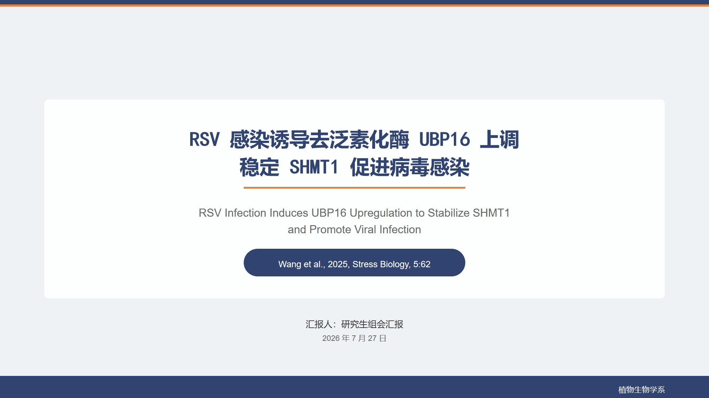
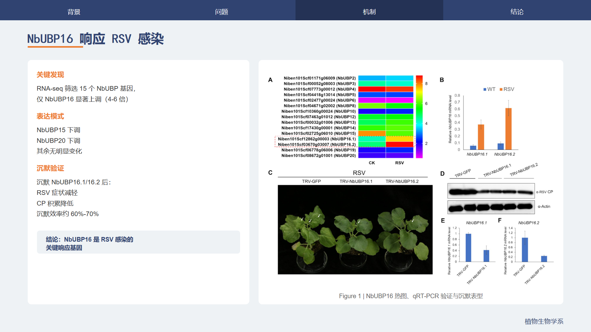
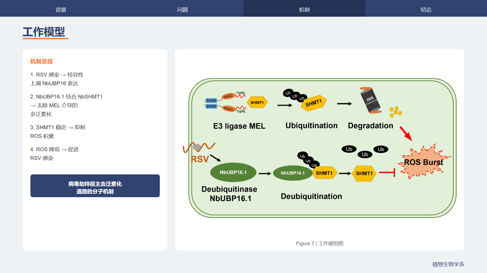

# paper-report-ppt

[](LICENSE)
[]()

> 上传一篇文献 PDF，自动生成**可编辑**的组会汇报 PPT。论文中的实验图表原样保留，同步生成配套的演讲稿 Word 文档。`ppt-master` 引擎已内置，克隆即用，无需额外安装依赖。**支持 WorkBuddy / Claude Code / Cursor / Qwen 等所有 AI 桌面应用，跨平台一致的高质量输出。**

---

## 效果预览

以下是用真实文献生成的组会汇报 PPT 截图：

| 封面页 | 结果页（实验图原样嵌入） | 工作模型页 |
|:------:|:------:|:------:|
| [](assets/screenshots/slide_01.png) | [](assets/screenshots/slide_07.png) | [](assets/screenshots/slide_13.png) |

**17 页完整 PPT，7 张实验图原样嵌入，三重质检全部通过。** [查看完整案例](#真实案例)

---

## 30 秒开始

### 一条命令安装（所有 AI 环境通用）

`ppt-master` 已**内置**在本 skill 的 `vendor/ppt-master/` 目录中，克隆即可使用，无需单独安装任何依赖：

```bash
# TRAE 用户
cd ~/.trae-cn/skills && git clone https://github.com/mlj-1212/paper-report-ppt.git

# Claude Code 用户
cd ~/.claude/skills && git clone https://github.com/mlj-1212/paper-report-ppt.git

# Cursor 用户
cd ~/.cursor/skills && git clone https://github.com/mlj-1212/paper-report-ppt.git

# Codex 用户
cd ~/.codex/skills && git clone https://github.com/mlj-1212/paper-report-ppt.git
```

克隆完成后，运行环境自检确认就绪：

```bash
cd paper-report-ppt
python scripts/install_check.py
```

看到 `✅ 核心依赖就绪` 即可开始使用。上传 PDF 说"生成组会汇报 PPT"就行。

> **为什么仓库较大（~61 MB）？** 因为 `ppt-master`（PPTX 生成引擎）已完整内置在 `vendor/ppt-master/` 中，用户无需额外安装。这是为了让任何 AI 环境都能开箱即用。

---

## 用法：两步生成 PPT

装好后，按下面两步走即可：

### 第 1 步：上传 PDF

把你的文献 PDF 发给 AI，说一句"生成组会汇报 PPT"就行。AI 会自动处理语言识别、页数、结构、图表嵌入、演讲稿生成等所有细节。

### 第 2 步：确认大纲，等待生成

AI 会先给你一个汇报大纲（类似目录），你回复"确认"后，AI 开始生成 PPT。处理完成后，你会收到：

- **一份 PPTX 文件** — 可编辑的组会汇报 PPT，论文图表原样保留
- **一份 DOCX 文件** — 完整的演讲稿，约 3000–6000 字

---

## 进阶用法

如果你想自定义汇报风格，可以在上传 PDF 时附带说明：

| 你想做什么 | 告诉 AI |
|---|---|
| 使用自己的 PPT 模板 | "用我上传的 PPTX 模板作为视觉风格" |
| 侧重创新点 | "侧重展示创新点和核心发现，控制在 10 页以内" |
| 英文汇报 | "用英文生成汇报" |
| 开题/答辩场景 | "用于开题汇报，约 20 页，重点展示研究背景和方法对比" |

---

## 功能特性

| 特性 | 说明 |
|------|------|
| **脉络模板预设** | 4 种汇报模板：IMRaD 均衡 / 问题驱动 / 创新点驱动 / 综述对比，一键切换 |
| **配图智能筛选** | 基于 caption 语义自动筛选和排序配图，过滤装饰图，sha256 去重 |
| **公式保真渲染** | 检测文献中 LaTeX 数学公式，复杂公式渲染为高清 PNG 嵌入 PPT，简单公式保留可编辑文本 |
| **文献脉络还原** | 按引言-方法-结果-讨论的结构自动组织汇报内容 |
| **配图原样保留** | 实验图、数据图从 PDF 原样提取，SHA256 校验，不做裁剪 |
| **PPT 模板支持** | 可基于你提供的 PPTX 模板生成统一风格演示文稿 |
| **同步演讲稿** | 生成完整口头演讲文字稿（DOCX），含开场白、逐页讲解、时长分配、问题预判 |
| **完全可编辑** | 输出为原生 PPTX，文本、形状、图片均可修改 |
| **质检报告** | 自动生成可编辑性 + 图片完整性 + 脉络一致性三重核验报告 |

---

## 适用场景

- 研究生组会文献汇报（Journal Club）
- 开题 / 中期 / 答辩演示
- 学术会议快速准备

---

## 真实案例

以下是用本工具处理一篇真实植物病理学文献的完整测试结果。

### 文献信息

| 项目 | 内容 |
|------|------|
| 论文 | *RSV infection induces upregulation of deubiquitinase UBP16 to stabilize SHMT1 for promoting viral infection* |
| 期刊 | **Stress Biology**, 2025, 5:62 |
| 作者 | Wang et al. |
| PDF | 10 页，含 7 张配图（Figure 1–7） |
| 汇报语言 | 中文 |

### 生成结果

| 指标 | 数值 |
|------|------|
| 总页数 | **17 页**（IMRaD 均衡模式） |
| 配图嵌入 | 7/7 原样嵌入（SHA256 全匹配） |
| PPTX 大小 | 1.15 MB |
| 演讲稿字数 | ~3,500 字（约 20 分钟） |

### 幻灯片结构

```
P01  封面          — 标题、作者、期刊、汇报人
P02  目录          — 六大板块导航
P03  文献选择依据   — 为什么选这篇
P04  研究背景      — RSV 与植物泛素化防御
P05  科学问题      — 核心假说与研究策略
P06  方法总览      — 多层次验证体系
P07  系统筛选      — NbUBP16 响应 RSV 感染 [Figure 1]
P08  蛋白互作      — NbUBP16.1 与 NbSHMT1 互作 [Figure 2]
P09  酶活验证      — 去泛素化稳定 NbSHMT1 [Figure 3]
P10  功能分析      — OE-NbSHMT1 抑制防御促进感染 [Figure 4]
P11  遗传验证      — NbUBP16.1 正向调控 RSV 感染 [Figure 5]
P12  ROS 检测      — NbUBP16.1 抑制 ROS 积累 [Figure 6]
P13  工作模型      — 病毒劫持宿主去泛素化通路 [Figure 7]
P14  讨论与创新点
P15  局限性与展望
P16  结论
P17  Q&A / 致谢
```

### 质检报告

| 检查项 | 结果 | 详情 |
|--------|------|------|
| **可编辑性** | ✅ PASS | 523 个原生对象（516 文本框 + 176 自选图形 + 7 图片），零整页图片 |
| **图片完整性** | ✅ PASS | 7/7 媒体文件 SHA256 与源文件完全匹配，图片原样未改 |
| **脉络一致性** | ✅ PASS | 17 页幻灯片与大纲一一对应，IMRaD 4/4 板块全部覆盖 |

### 输出文件

| 文件 | 格式 | 大小 |
|------|------|------|
| RSV_UBP16_组会汇报.pptx | PPTX | 1.15 MB |
| RSV_UBP16_组会汇报演讲稿.docx | DOCX | 14.6 KB |

### 演讲稿内容摘录

> 各位老师、同学们好！今天我汇报的文献是 2025 年发表在 Stress Biology 上的研究，题目是"RSV 感染诱导去泛素化酶 UBP16 上调，稳定 SHMT1 抑制 ROS 积累促进病毒感染"。这项研究首次揭示了植物去泛素化酶调控病毒感染的分子机制，提出了"病毒劫持宿主去泛素化通路"的新范式……

演讲稿包含：开场白 → 五个部分逐页讲解 → 结束语 → 时长分配表 → 问题预判（3 个 Q&A）。

---

## 平台支持

| 平台 | 支持状态 | 生成路径 | 说明 |
|------|---------|---------|------|
| **TRAE** | ✅ 原生支持 | 路径 A（SVG 管线） | 深度集成 ppt-master，质量最高 |
| **WorkBuddy** | ✅ 支持 | 路径 B（直接生成） | gen_pptx.py 绕过 SVG，python-pptx 直接构建 |
| **豆包 / Qwen** | ✅ 支持 | 路径 B（直接生成） | 同 WorkBuddy，仅需 Python + python-pptx |
| **Claude Code** | ✅ 支持 | 路径 B（直接生成） | 克隆到 skills 目录即可 |
| **Cursor** | ✅ 支持 | 路径 B（直接生成） | 克隆到 skills 目录即可 |
| **Codex** | ✅ 支持 | 路径 B（直接生成） | 有文件系统和执行能力即可 |
| **普通 Chatbot** | ⚠️ 不推荐 | 不适用 | 无文件系统时无法生成完整 PPT 文件 |

> **双轨生成**：路径 A 通过 SVG→DrawingML 管线生成（TRAE 专属），路径 B 通过 `gen_pptx.py` 用 python-pptx 直接构建。**非 TRAE 环境自动走路径 B**，保证跨平台一致的 300-500 个原生可编辑对象、完整配图嵌入、speaker notes。

---

## 工作流程

### TRAE 环境（路径 A）

```
第 1 步：确认需求
         ↓ 你告诉 AI：页数、语言、是否需要演讲稿、是否有模板
第 2 步：解析文献
         ↓ AI 读取 PDF，提取文字内容和实验图表
第 3 步：生成大纲
         ↓ AI 给出汇报目录，你回复"确认"或调整
第 4 步：生成 PPT
         ↓ AI 逐页手写 SVG，嵌入原图，导出为原生 PPTX
第 5 步：交付质检
         ↓ 自动检查：可编辑性 / 图片完整性 / 内容一致性
```

### 其他 AI 环境（路径 B，WorkBuddy / Claude / Cursor / Qwen）

```
第 1 步：确认需求
         ↓ 你告诉 AI：页数、语言、是否需要演讲稿
第 2 步：解析文献
         ↓ AI 读取 PDF，提取文字内容和实验图表
第 3 步：生成大纲
         ↓ AI 给出汇报目录，你回复"确认"或调整
第 4 步：生成 PPT（自动化）
         ↓ AI 生成 slides.json → gen_pptx.py 自动构建高质量 PPTX
         ↓ 无需手写 SVG，脚本自动处理布局、装饰、配图嵌入
第 5 步：交付质检
         ↓ 自动检查：可编辑性 / 图片完整性 / 内容一致性
```

> 路径 B 的核心区别在第 4 步：AI 只需要生成结构化 JSON 数据（slides.json），复杂的视觉布局由 `gen_pptx.py` 脚本自动完成。这确保了跨平台一致的输出质量。

---

## 依赖

### ppt-master（已内置）

`ppt-master`（PPTX 生成引擎）已**完整内置**在 `vendor/ppt-master/` 目录中：

| 环境 | 状态 | 处理方式 |
|------|------|----------|
| **任何 AI 环境** | ✅ 已内置 | 克隆本 skill 即包含，无需额外操作 |
| **TRAE** | 内置 + vendor 双保险 | 优先用 vendor 版本，保证一致性 |

路径解析优先级：环境变量 → `vendor/ppt-master/` → TRAE 内置 → 其他 skills 目录。

运行 `python scripts/install_check.py` 可确认路径是否正确解析。

### 运行时依赖

- Python 3.x（Windows 下自动回退到 `python`）
- Node.js + `docx` npm 包（演讲稿 DOCX 生成，可选）
- `matplotlib`（公式渲染为 PNG，可选）

---

## 输出产物

| 产物 | 格式 | 说明 |
|------|------|------|
| 可编辑 PPTX | `.pptx` | 主交付物，12–18 页原生可编辑幻灯片 |
| 演讲稿 | `.docx` | 完整口头演讲文字稿，3000–6000 字 |
| 质检报告 | `.json` | 可编辑性 / 图片完整性 / 脉络一致性 |
| 组会大纲 | `.md` | 脉络文档，含每页对应文献章节 |
| 文献解析 | `.md` + 配图 | 素材留档 |

---

## FAQ

**Q：提示"依赖 ppt-master skill"怎么办？**
A：`ppt-master` 已内置在 `vendor/ppt-master/` 目录中，正常克隆即可获得。如果提示未找到，可能是克隆不完整，重新执行 `git clone https://github.com/mlj-1212/paper-report-ppt.git` 即可。运行 `python scripts/install_check.py` 可确认状态。

**Q：PDF 中的矢量图（流程图/图表）能保留吗？**
A：位图原样嵌入；矢量图默认不提取，可在第一步选择栅格化（180 DPI）保留。

**Q：PPT 模板有什么限制？**
A：原始 PPTX 模板需要先走模板转换流程才能使用，转换后只影响视觉风格，不影响汇报结构。

**Q：演讲稿和 PPT 备注有什么区别？**
A：PPT 备注是每页 50–100 字的简短提示；演讲稿是独立 Word 文档（3000–6000 字），含开场白、过渡语、结束语和问题预判。

**Q：支持英文文献吗？**
A：支持。语言默认跟随文献语言，英文文献生成英文汇报。

**Q：可以一次处理多篇文献吗？**
A：当前版本支持单篇文献。多文献综述模式在优化方向中规划。

---

## 优化方向

- [ ] 多文献综述模式（2–5 篇文献对比）
- [x] 配图智能筛选与排序（基于 caption 语义，含 filter_images.py 脚本）
- [x] 公式保真（LaTeX 渲染为 PNG 嵌入，含 render_formula.py 脚本）
- [x] 组会脉络模板预设（IMRaD / 问题驱动 / 创新点驱动 / 综述对比）
- [ ] 增量更新（文献更新后只重新生成变化页面）

---

## License

[MIT](LICENSE) © 2026 mlj-1212
